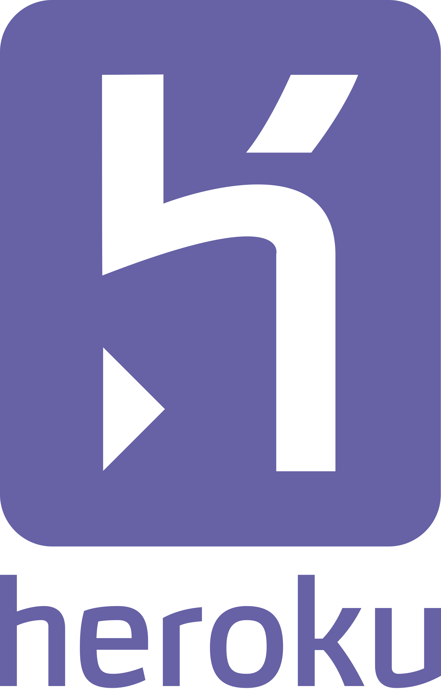
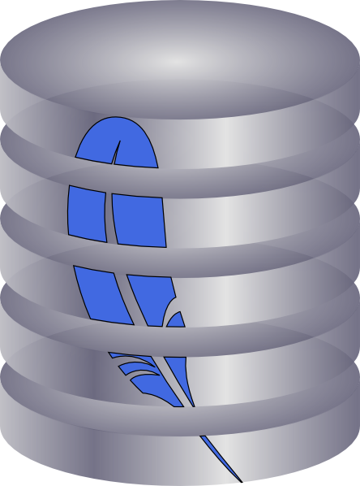

# Social

 

# Languages

    

# Tools

**Front End**

 

**Back End**

    

   

**UI/UX**

 

# Employment

- Head of Tech at [StockLift](https://www.stocklift.co) `July 2022 - Present`
- iOS Developer at [Private Island](https://privateisland.io) `Aug 2021 - June 2022`
- Full Stack Dev on [Upwork](https://www.upwork.com/freelancers/devboidesigns)

<!-- --- -->

<!--  -->
